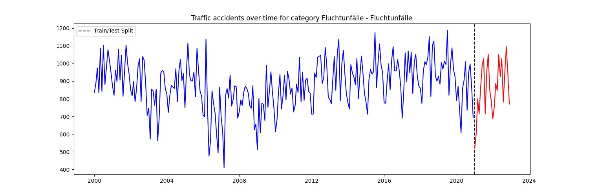
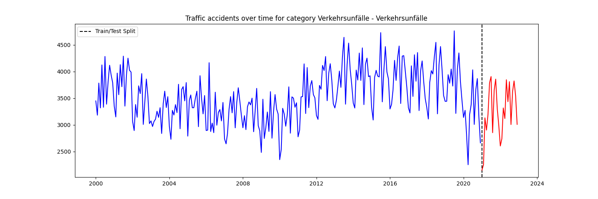
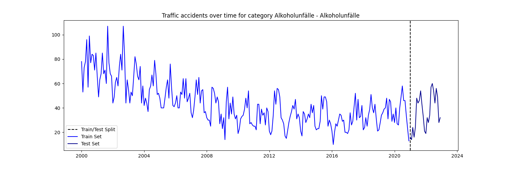
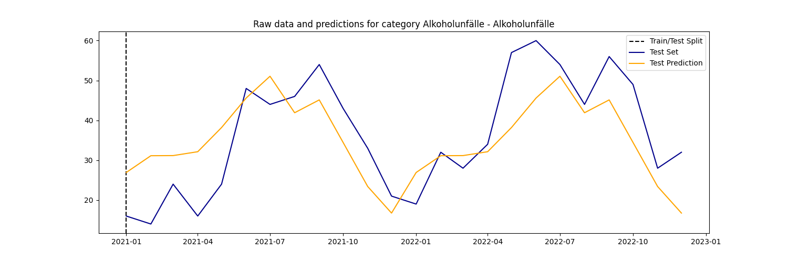

# dps-ai-challenge
## Project Overview
This repository contains my solution for the Digital Product School AI Engineering Challenge. The project focuses on analyzing and predicting traffic accident data for Munich.
## Dataset
The analysis uses the ["Monatszahlen Verkehrsunfälle"](https://opendata.muenchen.de/dataset/monatszahlen-verkehrsunfaelle/resource/40094bd6-f82d-4979-949b-26c8dc00b9a7) dataset from the München Open Data Portal. It contains monthly traffic accident statistics for various categories.

## Project Structure
- `api/`: Flask API to deploy the model, also contains subfolder `checkpoints\` with model weights
- `data/`: Contains the raw and processed datasets
- `media/`: Plot visualisations of the data
- `src/`: Source code for data processing, analysis and model training

## Getting Started
To get started with the dps-ai-challenge, follow these steps:

1. Clone the repository: git clone https://github.com/janik-j/dps-ai-challenge.git
2. Install the required dependencies: pip install -r requirements.txt
3. Download ["Monatszahlen Verkehrsunfälle"](https://opendata.muenchen.de/dataset/monatszahlen-verkehrsunfaelle/resource/40094bd6-f82d-4979-949b-26c8dc00b9a7) dataset from the München Open Data Portal and place it as "monthly_traffic_accidents.csv" in the data folder

## Usage
The main functionality of the project is accessed through the `main.py` script in the `src` directory. You can specify the category and scope of the data you're interested in, and choose whether to generate visualizations or predictions.

### Generating Graphs
To generate graphs for specific categories and scopes without making predictions, use the following commands:

- For accidents involving fleeing (`Fluchtunfälle`):
python src/main.py --category "Fluchtunfälle" --scope "insgesamt" --predict "No"

- For general traffic accidents (`Verkehrsunfälle`):
python src/main.py --category "Verkehrsunfälle" --scope "insgesamt" --predict "No"

- For general traffic accidents (`Alkoholunfälle`):
python src/main.py --category "Verkehrsunfälle" --scope "insgesamt" --predict "No"

### Making Predictions
To make predictions for specific categories and scopes on the test set, use the command with `--predict "Yes"`:

- For alcohol-related accidents (`Alkoholunfälle`):
python src/main.py --category "Alkoholunfälle" --scope "insgesamt" --predict "Yes"

