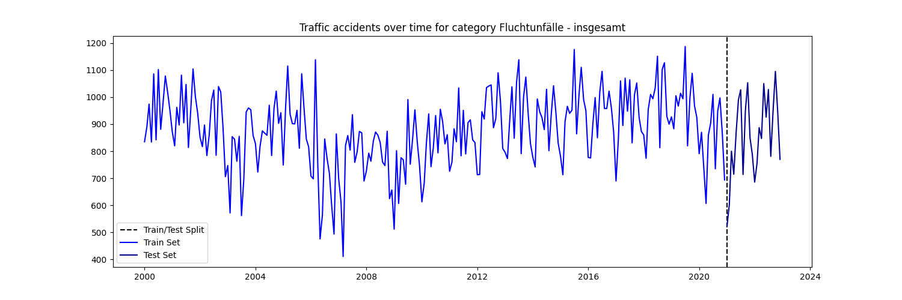
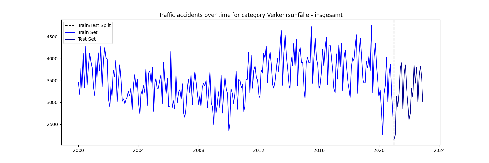
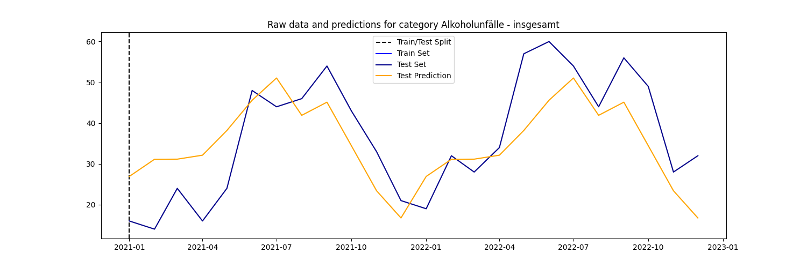
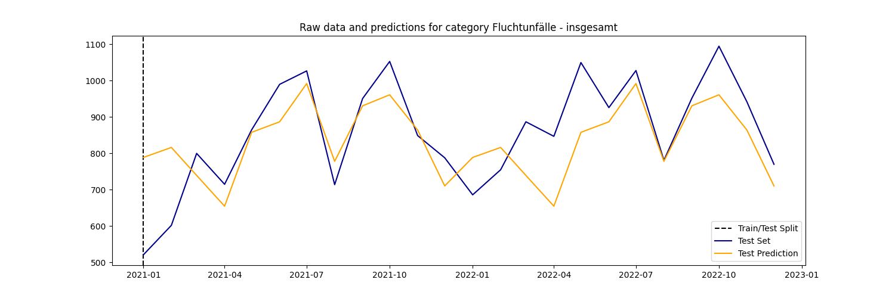
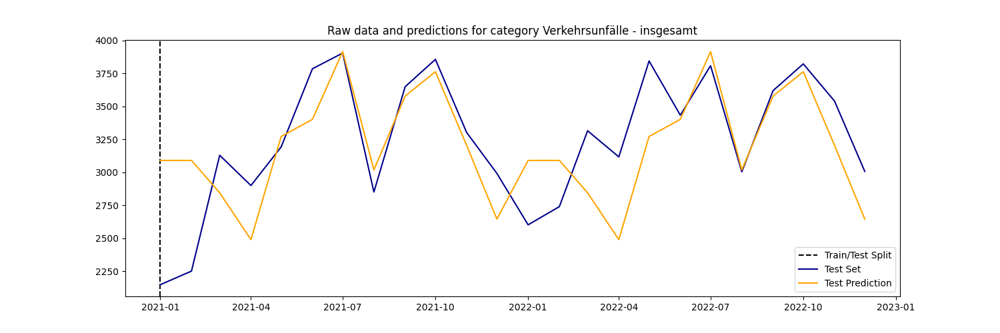
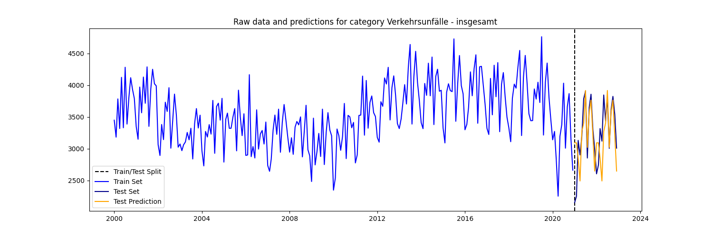
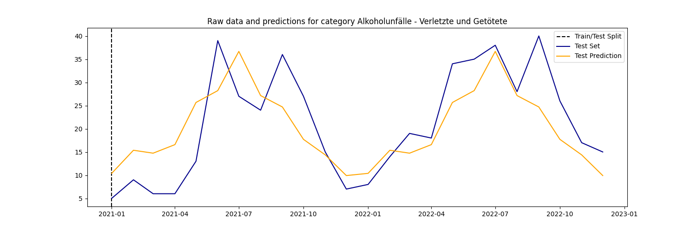

# dps-ai-challenge
## Project Overview
This repository contains my solution for the Digital Product School AI Engineering Challenge. The project focuses on analyzing and predicting traffic accident data for Munich.
## Dataset
The analysis uses the ["Monatszahlen Verkehrsunfälle"](https://opendata.muenchen.de/dataset/monatszahlen-verkehrsunfaelle/resource/40094bd6-f82d-4979-949b-26c8dc00b9a7) dataset from the München Open Data Portal. It contains monthly traffic accident statistics for various categories.

## Project Structure
- `api/`: Flask API to deploy the model, also contains subfolder `checkpoints/` with model weights
- `data/`: Contains the raw and processed datasets
- `media/`: Plot visualisations of the data
- `src/`: Source code for data processing, analysis and model training

## Getting Started
To get started with the dps-ai-challenge, follow these steps:

1. Clone the repository: git clone https://github.com/janik-j/dps-ai-challenge.git
2. Install the required dependencies: `pip install -r requirements.txt`
3. Download ["Monatszahlen Verkehrsunfälle"](https://opendata.muenchen.de/dataset/monatszahlen-verkehrsunfaelle/resource/40094bd6-f82d-4979-949b-26c8dc00b9a7) dataset from the München Open Data Portal and place it as "monthly_traffic_accidents.csv" in the data folder

## Usage
The main functionality of the project is accessed through the `main.py` script in the `src` directory. You can specify the category and scope of the data you're interested in, and choose whether to generate visualizations or predictions.

### Generating Plots
To generate plots for specific categories and scopes without making predictions, use the following commands:

- For alcohol-related accidents (Alkoholunfälle):.  
`python src/main.py --category "Verkehrsunfälle" --scope "insgesamt" --predict "No"` 

- For accidents involving fleeing (Fluchtunfälle):.  
`python src/main.py --category "Fluchtunfälle" --scope "insgesamt" --predict "No"` 

- For general traffic accidents (Verkehrsunfälle):.  
`python src/main.py --category "Verkehrsunfälle" --scope "insgesamt" --predict "No"` 

### Making Predictions
To make predictions for specific categories and scopes on the test set, use the command with `--predict "Yes"`:

- For alcohol-related accidents (Alkoholunfälle):.  
`python src/main.py --category "Alkoholunfälle" --scope "insgesamt" --predict "Yes"` 

- For accidents involving fleeing (Fluchtunfälle):.  
`python src/main.py --category "Fluchtunfälle" --scope "insgesamt" --predict "Yes"` 

- For general traffic accidents (Verkehrsunfälle):.  
`python src/main.py --category "Verkehrsunfälle" --scope "insgesamt" --predict "Yes"` 

- It's also possible to change the start and end date e.g. for general traffic accidents (Verkehrsunfälle):.  
`python src/main.py --category "Verkehrsunfälle" --scope "insgesamt" --predict "Yes" "2000-01-01" --end_date "2023-01-01"` 

- Or predict not for the whole scope but just "Verletzte und Geötete"  
`python src/main.py --category "Verkehrsunfälle" --scope "Verletzte und Geötete" --predict "Yes"` 

## Additional Information

### RMSE
- RMSE Score on the test set for category Alkoholunfälle is 10.19  
- RMSE will be always printed after running the script.

### Model
This project uses an XGBoost regressor for predicting traffic accident data. The model is implemented using the XGBoost library and is configured with specific hyperparameters to optimize performance. Key features include:

Booster type: Gradient Boosted Trees (gbtree)
Number of estimators: 5000
Maximum tree depth: 5
Learning rate: 0.001

The trained model is saved using joblib for easy loading and deployment. The model's checkpoint is stored in the api/checkpoints/ directory.